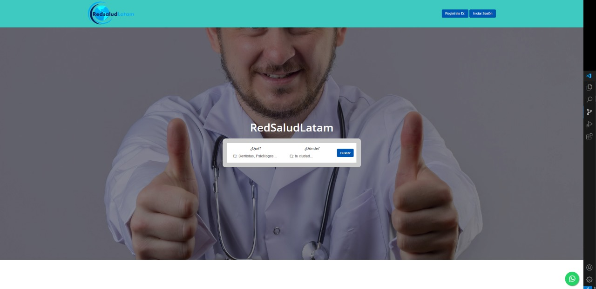

# RedSaludLatam
¡Tu mejor opción para contactar a tus compañeros profesionistas!

Este proyecto propone recopilar los medios de contacto y la información relevante acerca de la especialidad en el campo de los trabajadores del área de salud en toda Latinoamérica en una página web que busque ser de rápido acceso y funcione como un medio de contacto entre usuarios. 

La plataforma inicia mostrando una página por la cual se puede dirigir a módulos como búsqueda de otros perfiles, creación de usuarios e inicio de sesión.

  <strong>Inicio</strong>
   
  

Si se decide iniciar sesión, el sistema arrojará una pequeña ventana en la cual se podrán ingresar las credenciales para entrar al perfil de usuario registrado en la plataforma.

  <strong>Iniciar sesión</strong>
   
  

En caso de que no se cuente con un usuario dado de alta, se tiene la opción de crear uno en la sección de registrarse, donde se le solicitaran datos personales, un usuario y una contraseña.

  <strong>Registro</strong>
   
  

Finalmente, si se desea contactar a otros usuarios de la plataforma, por medio de la barra de búsqueda ubicada en el inicio se pueden filtrar en base a:
    1.- Qué es lo que se busca.
    2.- Dónde se espera encontrar al usuario.

Habiendo ingresado los datos, se desplegarán los resultado de la búsqueda que se adapten a lo que el usuario deseaba encontrar.

  <strong>Búsqueda</strong>
   
  

